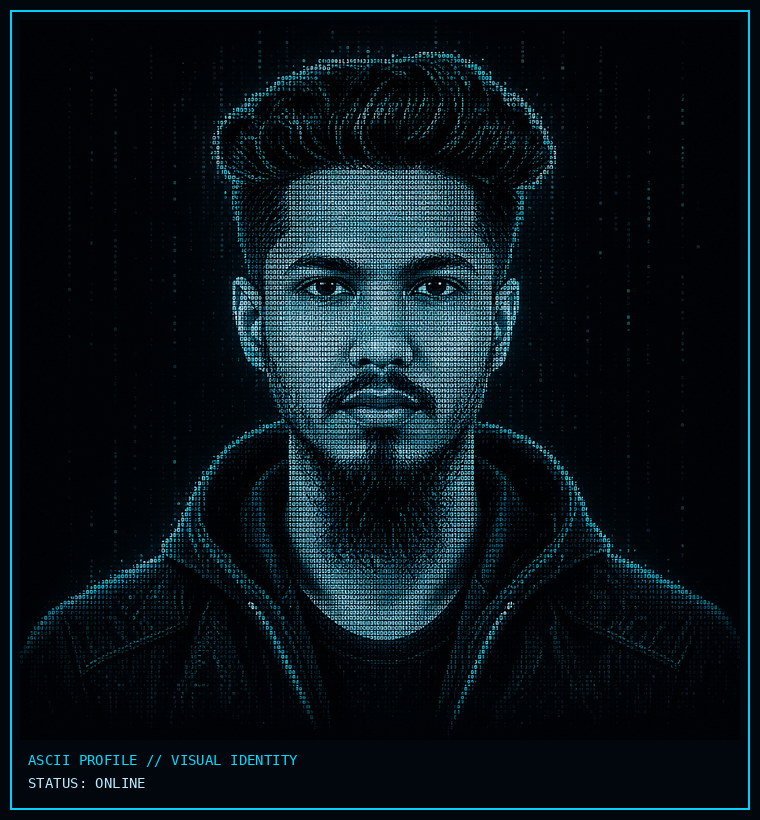

<div align="center">

# `ARAFAT KHAN`

### `AI / ML ENGINEER IN PROGRESS`

`DATA SCIENCE` · `COMPUTER VISION` · `MACHINE LEARNING` · `RESEARCH`

[](https://github.com/iamthearafatkhan)
[](https://www.linkedin.com/in/iamthearafatkhan/)

</div>

---

## `01 // PROFILE.SCAN`

**Sequence:** profile-scan → scanning line → scan complete → ASCII avatar + identity.

<p align="center">
  
</p>

### Identity

<table>
<tr>
<td width="52%" align="center">

</td>
<td width="48%" valign="top">

```text
┌─ PROFILE.IDENTITY ───────────────────┐

  NAME
  Arafat Khan

  NATIONALITY
  🇧🇩 Bangladeshi

  ROLE
  AI / ML Engineer in Progress

  FIELD
  Data Science · Computer Vision

  INTEREST
  AI · ML · CV · Research · Data

  EDUCATION
  BSc · Computer Science & Engineering

  NEXT
  MSc · Data Science · 2027

└──────────────────────────────────────┘
```

</td>
</tr>
</table>

---

## `02 // SKILL.MATRIX`

<div align="center">

### Core


### Development


### Engineering


</div>

---

## `03 // PROJECT.ARCHIVE`

> Curated project cards are manual. The GitHub system metrics below are automatic.

### `01` — DLR-PCVW · Few-Shot Acne Severity Classification

**Repository:** [GitHub](https://github.com/iamthearafatkhan/DLR-PCVW-Acne-severity-classifier-using-few-shot)  
**Live:** [AcneGrad AI](https://acnegrad-ai.streamlit.app/)


`EfficientNet-B0` · `Few-Shot Learning` · `FiLM` · `PCVW` · `Streamlit` · `Hugging Face`

A lesion-aware few-shot acne severity classification system developed as the BSc thesis project, using prototype-based learning with feature calibration and per-channel variance weighting.

---

### `02` — Email Spam Detection

**Repository:** [GitHub](https://github.com/iamthearafatkhan/Email-Spam-Detection)


`Transformers` · `NLP` · `Deep Learning` · `Jupyter`

A transformer-based NLP project for classifying email messages as spam or legitimate.

---

### `03` — Diabetes Prediction

**Repository:** [GitHub](https://github.com/iamthearafatkhan/Diabetes-Prediction-using-Flask)


`ANN` · `SMOTE` · `Machine Learning` · `Flask` · `HTML` · `CSS`

A machine-learning web application for diabetes prediction, combining an artificial neural network pipeline with SMOTE-based handling of class imbalance.

---

### `04` — COVID-19 Vaccine Registration System

**Repository:** [GitHub](https://github.com/iamthearafatkhan/Vaccine-Registration)


A web-based vaccine registration system built with PHP and MySQL, with HTML/CSS/JavaScript on the front end.

---

### `05` — Car Price Prediction

**Repository:** [GitHub](https://github.com/iamthearafatkhan/Car-Price-Prediction-ML)


`Machine Learning` · `Regression` · `Flask` · `HTML` · `CSS`

A machine-learning regression project that predicts car prices through a Flask web interface.

---

### `06+` — Future Projects

Add important future projects here. The live repository counter does **not** need manual editing.

---

## `04 // CONTRIBUTION.MAP`

<div align="center">

</div>

---

## `05 // GITHUB.SYSTEM`

<div align="center">


<br>


</div>

### Automatic

- **Public repository count** — fetched from GitHub
- **Total stars** — summed across public repositories
- **Current-year contributions** — fetched through GitHub GraphQL
- **Profile views** — third-party counter

So if you go from **6 → 7 → 8 repositories**, you do not edit the stats number manually.

> The project archive is intentionally curated separately; the system metrics are automatic.

---

## `06 // CONNECT`

<div align="center">

[](https://github.com/iamthearafatkhan)
[](https://www.linkedin.com/in/iamthearafatkhan/)
[](mailto:arafat.khan.work@gmail.com)

`PORTFOLIO // COMING SOON`

</div>

---

<div align="center">

> `BUILD.` · `RESEARCH.` · `DEPLOY.`

**AI is not just something I study. It's something I want to build.**

</div>
