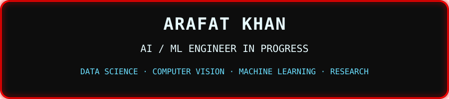
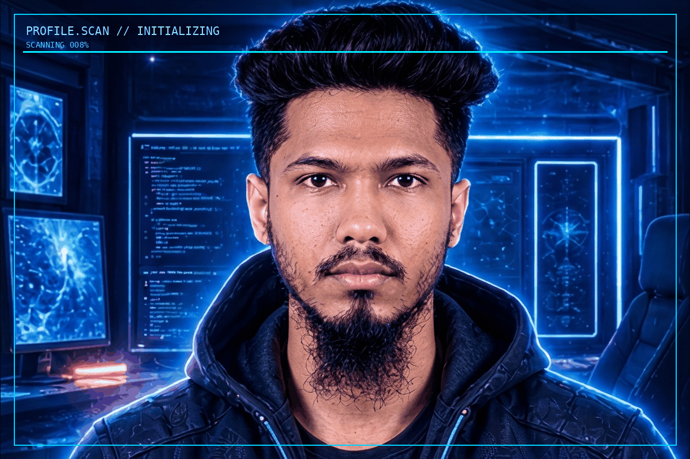
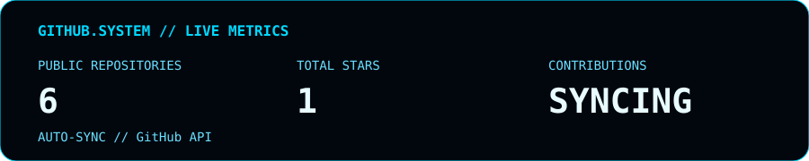

---

<!-- ===== PROFILE Scan ===== -->
<div style="border:2px solid #00d9ff; border-radius:20px; padding:24px; margin:30px 0; background:rgba(0,217,255,0.03); box-shadow:0 0 30px rgba(0,217,255,0.12);">

## `PROFILE`

<table width="100%">
<tr>
<td width="50%" align="center">



</td>
<td width="50%" valign="top" style="padding-left:24px;">

<div style="border:2px solid #00d9ff; border-radius:12px; padding:16px; background:rgba(0,217,255,0.05);">

```text
┌─ IDENTITY ───────────────────────────┐

  NAME
  Md Arafat Hossen Rabby

  NATIONALITY
  🇧🇩 Bangladeshi

  ROLE
  AI / ML Engineer in Progress

  FIELD
  Data Science · Computer Vision

  INTEREST
  AI · ML · CV · Research · Data

  EDUCATION
  BSc · Computer Science & Engineering - 2026

  NEXT
  MSc · Data Science · 2027

└──────────────────────────────────────┘
```

</td>
</tr>
</table>

---

<!-- ===== WEBSITE ===== -->
## `🌐 WEBSITE`
<div style="border:2px solid #00d9ff; border-radius:20px; padding:16px 32px; margin:20px auto; display:inline-block; box-shadow:0 0 25px rgba(0,217,255,0.2); background:rgba(0,217,255,0.05);"> <a href="https://khan.dev" style="font-size:28px; font-weight:bold; color:#00d9ff; text-decoration:none; letter-spacing:4px;">🌐 khan.dev</a> </div>

<!-- ===== SKILLS ===== -->

<div style="border:2px solid #00d9ff; border-radius:20px; padding:24px; margin:30px 0; background:rgba(0,217,255,0.03); box-shadow:0 0 30px rgba(0,217,255,0.12);">

## `SKILLS`
<div align="center">
Core

Development


Engineering
</div>
</div>
<!-- ===== PROJECTS ===== --><div style="border:2px solid #00d9ff; border-radius:20px; padding:24px; margin:30px 0; background:rgba(0,217,255,0.03); box-shadow:0 0 30px rgba(0,217,255,0.12);">

---

## `PROJECTS`
Each project card is manually curated. The live system metrics below are automatic.

<!-- Project 1 -->
<div style="border:2px solid #00d9ff; border-radius:16px; padding:20px; margin:18px 0; background:rgba(0,217,255,0.05); box-shadow:0 0 20px rgba(0,217,255,0.10);"> <h3 style="color:#00d9ff; margin-top:0;">DLR‑PCVW · Few‑Shot Acne Severity Classification</h3> <p> <a href="https://github.com/iamthearafatkhan/DLR-PCVW-Acne-severity-classifier-using-few-shot"></a> <a href="https://acnegrad-ai.streamlit.app/"></a> </p>  <p><code>EfficientNet‑B0</code> · <code>Few‑Shot Learning</code> · <code>FiLM</code> · <code>PCVW</code> · <code>Streamlit</code> · <code>Hugging Face</code></p> <p style="color:#c0d0e0;">A lesion‑aware few‑shot acne severity classification system developed as the BSc thesis project, using prototype‑based learning with feature calibration and per‑channel variance weighting.</p> </div><hr style="border:1px solid rgba(0,217,255,0.2); margin:24px 0;">
<!-- Project 2 -->
<div style="border:2px solid #00d9ff; border-radius:16px; padding:20px; margin:18px 0; background:rgba(0,217,255,0.05); box-shadow:0 0 20px rgba(0,217,255,0.10);"> <h3 style="color:#00d9ff; margin-top:0;">Email Spam Detection</h3> <p> <a href="https://github.com/iamthearafatkhan/Email-Spam-Detection"></a> <a href="https://email-spam-detection23.streamlit.app/"></a> </p>  <p><code>Transformers</code> · <code>NLP</code> · <code>Deep Learning</code> · <code>Jupyter</code></p> <p style="color:#c0d0e0;">A transformer‑based NLP project for classifying email messages as spam or legitimate.</p> </div><hr style="border:1px solid rgba(0,217,255,0.2); margin:24px 0;">
<!-- Project 3 -->
<div style="border:2px solid #00d9ff; border-radius:16px; padding:20px; margin:18px 0; background:rgba(0,217,255,0.05); box-shadow:0 0 20px rgba(0,217,255,0.10);"> <h3 style="color:#00d9ff; margin-top:0;">Diabetes Prediction</h3> <p> <a href="https://github.com/iamthearafatkhan/Diabetes-Prediction-using-Flask"></a> </p>  <p><code>ANN</code> · <code>SMOTE</code> · <code>Machine Learning</code> · <code>Flask</code> · <code>HTML</code> · <code>CSS</code></p> <p style="color:#c0d0e0;">A machine‑learning web application for diabetes prediction, combining an artificial neural network pipeline with SMOTE‑based handling of class imbalance.</p> </div><hr style="border:1px solid rgba(0,217,255,0.2); margin:24px 0;">
<!-- Project 4 -->
<div style="border:2px solid #00d9ff; border-radius:16px; padding:20px; margin:18px 0; background:rgba(0,217,255,0.05); box-shadow:0 0 20px rgba(0,217,255,0.10);"> <h3 style="color:#00d9ff; margin-top:0;">COVID‑19 Vaccine Registration System</h3> <p> <a href="https://github.com/iamthearafatkhan/Vaccine-Registration"></a> </p>  <p style="color:#c0d0e0;">A web‑based vaccine registration system built with PHP and MySQL, with HTML/CSS/JavaScript on the front end.</p> </div><hr style="border:1px solid rgba(0,217,255,0.2); margin:24px 0;">
<!-- Project 5 -->
<div style="border:2px solid #00d9ff; border-radius:16px; padding:20px; margin:18px 0; background:rgba(0,217,255,0.05); box-shadow:0 0 20px rgba(0,217,255,0.10);"> <h3 style="color:#00d9ff; margin-top:0;">Car Price Prediction</h3> <p> <a href="https://github.com/iamthearafatkhan/Car-Price-Prediction-ML"></a> </p>  <p><code>Machine Learning</code> · <code>Regression</code> · <code>Flask</code> · <code>HTML</code> · <code>CSS</code></p> <p style="color:#c0d0e0;">A machine‑learning regression project that predicts car prices through a Flask web interface.</p> </div>

</div>

</div>
<!-- ===== CONTRIBUTIONS ===== -->

<div style="border:2px solid #00d9ff; border-radius:20px; padding:24px; margin:30px 0; background:rgba(0,217,255,0.03); box-shadow:0 0 30px rgba(0,217,255,0.12);">

## `CONTRIBUTION`
  
<div align="center">  </div></div>
<!-- ===== LIVE STATS ===== -->
<div style="border:2px solid #00d9ff; border-radius:20px; padding:24px; margin:30px 0; background:rgba(0,217,255,0.03); box-shadow:0 0 30px rgba(0,217,255,0.12);">

## `LIVE STATS`
<div align="center">


</div>
Public repositories – fetched from GitHub

Total stars – summed across all public repos

Current‑year contributions – via GitHub GraphQL

Profile views – third‑party counter

Add a new repository → stats update automatically. No manual editing needed.

</div>
<!-- ===== CONNECT ===== --><div style="border:2px solid #00d9ff; border-radius:20px; padding:24px; margin:30px 0; background:rgba(0,217,255,0.03); box-shadow:0 0 30px rgba(0,217,255,0.12);">
<!-- ===== CONNECT ===== -->
<div style="border:2px solid #00d9ff; border-radius:20px; padding:24px; margin:30px 0; background:rgba(0,217,255,0.03); box-shadow:0 0 30px rgba(0,217,255,0.12);">

## `CONNECT`

<div align="center">

[](https://github.com/iamthearafatkhan)
[](https://www.linkedin.com/in/iamthearafatkhan/)
[](https://facebook.com/iamthearafatkhan)
[](https://x.com/iamarafat33)
[](mailto:arafathossen21233@gmail.com)

`PORTFOLIO // COMING SOON`

</div>

</div>
</div></div>

<div align="center">
BUILD. · RESEARCH. · DEPLOY.

AI is not just something I study. It's something I want to build.

</div> ```
